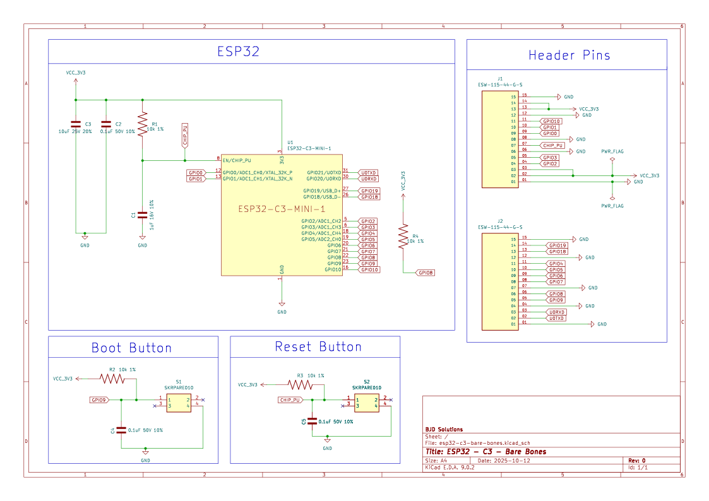

# ESP32-C3 - Bare Bones DevKitM - KiCAD Source Files

This project is a work in progress.

## Goal: 

Create a simplified custom PCB based on the [ESP32-C3-DevKitM-1](https://docs.espressif.com/projects/esp-dev-kits/en/latest/esp32c3/esp32-c3-devkitm-1/user_guide.html)

This board is designed to consume as little power as possible while in deep sleep. Ideally 5uF as per the ESP-32 [datasheet](https://www.espressif.com/sites/default/files/documentation/esp32-c3-mini-1_datasheet_en.pdf). To this end the Voltage Regulator, RGB LED, Power LED and USB-UART interface have been removed. Leaving just the MCU, Reset/Boot button and header pins.

The board will need to be powered directly with a power source between 3.0 and 3.6v. It is important that the voltage never exceed 3.6v. Regular Lipo batteries typically have a maximum voltage of 4.2v so are not suitable.

This board was designed to be powered by a 3.2v LiFePO4 battery. LiFePO4 batteries can reach 3.65v when fully charged. A BMS set to cut off at 3.6V or slightly lower will be necesary.

The board will need to be programmed with an FDTI programmer as there is no USB interface.

## Resources:

* [ESP32-C3-MINI-1 MCU Datasheet](https://www.espressif.com/sites/default/files/documentation/esp32-c3-mini-1_datasheet_en.pdf)
* [ESP32-C3-DevKitM-1 Docs](https://docs.espressif.com/projects/esp-dev-kits/en/latest/esp32c3/esp32-c3-devkitm-1/user_guide.html)
* [ESP32-C3-DevKitM-1 Schematic](https://dl.espressif.com/dl/schematics/SCH_ESP32-C3-DEVKITM-1_V1_20200915A.pdf)

## Schematic:

[PDF Version](esp32-c3-bare-bones-schematic.pdf)

